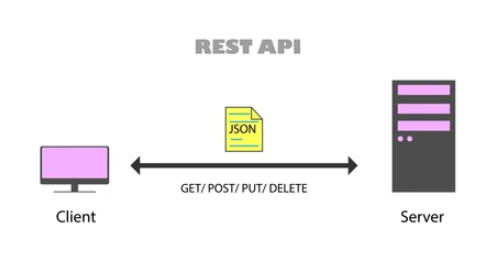

[](https://classroom.github.com/a/CaXtHsbh)

[](https://coveralls.io/github/ULL-ESIT-INF-DSI-2324/ull-esit-inf-dsi-23-24-prct13-dsikea-api-groupn?branch=main)

[](https://github.com/ULL-ESIT-INF-DSI-2324/ull-esit-inf-dsi-23-24-prct13-dsikea-api-groupn/actions/workflows/build.yml)

[](https://github.com/ULL-ESIT-INF-DSI-2324/ull-esit-inf-dsi-23-24-prct13-dsikea-api-groupn/actions/workflows/node.js.yml)

# Informe Práctica 13 - DSIkea: API REST con Node/Express



## Manuel David Gómez Alonso
> [alu0101347301@ull.edu.es](mailto:alu0101347301@ull.edu.es)
## Daniel Bensa Expósito Paz
> [alu0101481876@ull.edu.es](mailto:alu0101481876@ull.edu.es)
## Alejandro Javier Aguiar Pérez
> [alu0101487168@ull.edu.es](mailto:alu0101487168@ull.edu.es)
 
## Índice
1. [Resumen Proyecto](#resumen-proyecto)
2. [Modelado de objetos con Mongoose](#modelado-de-objetos-con-mongoose)
    - [Modelo Customer](#modelo-customer)
    - [Modelo Provider](#modelo-provider)
    - [Modelo Furniture](#modelo-furniture)
    - [Modelo Transaction](#modelo-transaction)
3. [Rutas](#rutas)
    - [/customers](#/customers)
    - [/providers](#/providers)
    - [/furnitures](#/furnitures)
    - [/transactions](#/transactions)
4. [Test sobre el API](#test-sobre-el-api)
5. [Despliegue API](#despliegue-api)
    - [MongoDB Atlas](#mongodb-atlas)
    - [Render](#render)
6. [Peticiones](#peticiones)
7. [Conclusiones del proyecto](#conclusiones-del-proyecto)
8. [Referencias](#referencias)

## Resumen Proyecto

El proyecto consiste en desarrollar una **API REST** para gestionar transacciones de muebles utilizando **Node.js**, **Express**, **Mongoose** y **MongoDB**. La API debe permitir a clientes y proveedores realizar **transacciones de compra y venta** de muebles, además de llevar a cabo operaciones **CRUD (Crear, Leer, Actualizar, Borrar)** para gestionar **clientes**, **proveedores**, **muebles** y **transacciones**.

En cuanto a los requisitos específicos del API, se detallan las rutas y operaciones que deben ser implementadas:

- **Clientes (/customers)**: Se deben poder realizar operaciones CRUD para gestionar clientes. La lectura o consulta de clientes puede realizarse por **NIF** o por **identificador único**. Se deben implementar **siete manejadores** diferentes para esta ruta.
- **Proveedores (/providers)**: Debe ser posible realizar operaciones CRUD para gestionar proveedores. La lectura o consulta de proveedores puede hacerse por **CIF** o por **identificador único**. También se requieren **siete manejadores** diferentes para esta ruta.
- **Muebles (/furnitures)**: Se deben implementar operaciones CRUD para gestionar muebles. La lectura o consulta de muebles puede hacerse por **diferentes campos**, como nombre, descripción o color, o por identificador único. Se necesitan **siete manejadores** diferentes para esta ruta.
- **Transacciones (/transactions)**: Debe ser posible crear, leer, actualizar y borrar transacciones con clientes y/o proveedores. Una transacción incluye información del **cliente/proveedor** y de los **muebles** involucrados, además de otros datos como fecha, hora e importe. Se deben manejar situaciones como la existencia previa de clientes/proveedores o muebles, la **actualización de stock** en caso de compra a proveedores, entre otros aspectos complejos. Se requieren **seis manejadores** diferentes para esta ruta.

También se debe de comprobar la funcionalidad del API elaborando las necesarias **pruebas unitarias**, y una vez concluida la correcta funcionalidad del API, desplegar la misma haciendo uso de **MongoDB Atlas** como base de datos y **Render**.

> **[Volver al índice](#índice)**

## Modelado de objetos con Mongoose

En este proyecto, se han creado varios modelos de objetos utilizando **Mongoose** para la interacción con la base de datos **MongoDB**. A continuación se detallan los modelos implementados:

### Modelo Customer

El modelo *Customer* es una representación de un **cliente** en la base de datos.

Se crea una interfaz: *ICustomer* que se extiende de la interfaz *Document* de **Mongoose**, lo que significa que una instancia de *ICustomer* es un **documento** de **Mongoose** que puede ser guardado en la base de datos. La interfaz *ICustomer* define los siguientes campos:

```ts
export interface ICustomer extends Document {
  name: string;
  contact: string;
  email: string;
  postalCode: string;
  dni: string;
}
```

El esquema *customerSchema* define cómo se guardan los datos en la base de datos de **MongoDB**. Define los mismos campos que la interfaz *ICustomer*, pero también especifica el **tipo de datos** de cada campo, si el campo es **requerido**, y cualquier **validación** que deba realizarse en el campo.

La **validación** se realiza utilizando la biblioteca **validator**. Por ejemplo, el campo *email* utiliza *validator.isEmail(value)* para verificar si el valor es un correo electrónico válido. Además se devuleve un mensaje de error especificando porque la creación del objeto ha fallado.

```ts
export const customerSchema: Schema = new Schema<ICustomer>({
  // Otros atributos...
  email: {
    type: String,
    required: true,
    validate: {
      validator: (value: string) => validator.isEmail(value),
      message: "Invalid email",
    },
  },
  // Otros atributos
});
```

Por último comentar la **validación** del campo *dni* que identifica al **cliente** y por lo tanto debe ser única, para comprobar el dni se usa la fórmula definida para comprobar que la última letra coincida con los dígitos previos.

```ts
export const customerSchema: Schema = new Schema<ICustomer>({
  dni: {
    type: String,
    unique: true,
    required: true,
    validate: {
      validator: (value: string) => {
        const numeroDNI = parseInt(value.slice(0, -1), 10);
        const letraDNI = value.slice(-1);
        return letraDNI === calcularLetraDNI(numeroDNI);
      },
      message: "Invalid DNI",
    },
  },
});
```

Donde *calcularLetraDNI(numeroDNI)* es una llamada a la función auxiliar que calcula la **última letra** en base a los dígitos anteriores.

```ts
function calcularLetraDNI(numeroDNI: number) {
  const letras = 'TRWAGMYFPDXBNJZSQVHLCKE';
  const resto = numeroDNI % 23;
  return letras.charAt(resto);
}
```

> **[Volver al índice](#índice)**

### Modelo Provider

El modelo *Provider* es una representación de un **proveedor** en la base de datos. Es muy similar a el modelo *Customer* pero cambiando el atributo *dni*, que se resume en ocho dígitos y una letra final mayúscula, por el atributo *cif*, que empieza por una letra mayúscula seguida de 8 digitos.

Se crea una interfaz *IProvider* que se extiende de la interfaz *Document* de **Mongoose**, lo que significa que una instancia de *IProvider* es un **documento** de **Mongoose** que puede ser guardado en la base de datos. La interfaz *IProvider* define los siguientes campos:

```ts
export interface IProvider extends Document {
  name: string;
  contact: string;
  postalCode: string;
  cif: string;
}
```

El esquema *providerSchema* define cómo se guardan los datos en la base de datos de **MongoDB**. Define los mismos campos que la interfaz *IProvider*, pero también especifica el **tipo de datos** de cada campo, si el campo es **requerido**, y cualquier **validación** que deba realizarse en el campo.

La **validación** es este caso del campo *cif* del que hablabamos anteriormente se debe verificar de manera especial al igual que el campo *dni* de un *customerSchema*. Se debe de tener en cuenta que el primer dígito del *cif* no se elige de manera aleatoria y que depende de los digitos posteriores, para ello usamos una constante de **letras de control** permitidas y comprobamos que todo coincida como debería.

```ts
export const providerSchema: Schema = new Schema<IProvider>({
  // Otros atributos
  cif: {
    type: String,
    unique: true,
    required: true,
    validate: {
      validator: (value: string) => {
        const control = 'JABCDEFGHI';
        const digit = value.slice(1, -1);
        const letter = value.charAt(0);
        const controlDigit = value.slice(-1);
  
        let sum = 0;
        for (let i = 0; i < digit.length; i++) {
          const num = parseInt(digit.charAt(i), 10);
          if (i % 2 === 0) {
            sum += [0, 2, 4, 6, 8, 1, 3, 5, 7, 9][num];
          } else {
            sum += num;
          }
        }
  
        const calculatedControlDigit = sum % 10 === 0 ? 0 : 10 - (sum % 10);
        return (
          /^[ABCDEFGHJNPQRSUVW]{1}/.test(letter) &&
          digit.length === 7 &&
          (controlDigit === calculatedControlDigit.toString() ||
            controlDigit === control.charAt(calculatedControlDigit))
        );
      },
      message: "Invalid CIF",
    },
  },
  // Otros atributos
});
```

> **[Volver al índice](#índice)**

### Modelo Furniture

El modelo *Furniture* es una representación de un **mueble** en la base de datos.

Se crea la interfaz *IFurniture* que se extiende de la interfaz *Document* de **Mongoose**, lo que significa que una instancia de *IFurniture* es un documento de **Mongoose** que puede ser guardado en la base de datos. La interfaz *IFurniture* define los siguientes campos:

```ts
export interface IFurniture extends Document {
  name: string;
  description: string;
  material: string;
  dimensions: Dimension;
  price: number;
  quantity: number;
  color: string;
}
```

Donde el tipo *Dimension* es un objeto que representa las **dimensiones** de un mueble. Incluye los campos *length*, *width* y *height*, todos los cuales son números.

```ts
type Dimension = {
  length: number;
  width: number;
  height: number;
};
```

El esquema *furnitureSchema* define cómo se guardan los datos en la base de datos de **MongoDB**. Define los mismos campos que la interfaz *IFurniture*, pero también especifica el **tipo de datos** de cada campo, si el campo es **requerido**, y cualquier **validación** que deba realizarse en el campo, que en el caso de este *schema* se necesita solamente en el campo *quantity*, para que la cantidad nunca sea **menor que cero**. También se usan enumerados para algunos campos. Por ejemplo, el campo material es un string que debe ser uno de los siguientes: *"wood"*, *"metal"*, *"plastic"*, *"glass"*, *"fabric"*, *"leather"*.

```ts
export const furnitureSchema: Schema = new Schema<IFurniture>({
  // Otros atributos
  material: {
    type: String,
    enum: ["wood", "metal", "plastic", "glass", "fabric", "leather"],
    required: true,
  },
  // Otros atributos
  quantity: {
    type: Number,
    required: true,
    validate: {
      validator: function (value: number) {
        return value >= 0;
      },
      message: "Quantity must be a non-negative number",
    },
  },
  // Otros atributos
});
```

> **[Volver al índice](#índice)**

### Modelo Transaction

El modelo *Transaction* es una representación de una **transacción** en la base de datos. El modelo *Transaction* trabaja en coordinación con todos los demás modelos vistos previamente: *customerSchema*, *providerSchema*, *furnitureSchema*.

Se crea interfaz *ITransaction* que se extiende de la interfaz *Document* de **Mongoose**, lo que significa que una instancia de *ITransaction* es un documento de **Mongoose** que puede ser guardado en la base de datos. La interfaz *ITransaction* define los siguientes campos:

```ts
export interface ITransaction extends Document {
  type: "Purchase" | "Sale";
  furniture: FurnitureTuple[];
  customer?: typeof customerSchema;
  provider?: typeof providerSchema;
  date: Date;
  price: number;
}
```

Donde el tipo *FurnitureTuple* es un objeto que representa un par de **mueble** y **cantidad**. Incluye los campos *furniture* y *quantity*.

```ts
export interface FurnitureTuple {
  furniture: typeof furnitureSchema;
  quantity: number;
}
```

El esquema *transactionSchema* define cómo se guardan los datos en la base de datos de **MongoDB**. Define los mismos campos que la interfaz *ITransaction*, pero también especifica el **tipo de datos** de cada campo, si el campo es **requerido**, y cualquier **validación** que deba realizarse en el campo.

Por ejemplo, el campo type es un *string* que debe ser *"Purchase"* o *"Sale"*. El campo *furniture* es un array de objetos, cada uno de los cuales debe tener un campo *furniture* que es un *ObjectId* que hace **referencia a un documento** de *Furniture*, y un campo *quantity* que es un número. No se usa el módulo validator ya que los atributos usados son enumerados en el caso de *type*, o bien **referencias a otros modelos**, o tienen pensado crearse de manera automatica por el programa como *date* y *price* y por lo tanto no debería de estar sujeto a errores.

```ts
export const transactionSchema = new Schema<ITransaction>({
  type: {
    type: String,
    enum: ["Purchase", "Sale"],
    required: true,
  },
  furniture: [
    {
      furniture: {
        type: Schema.Types.ObjectId,
        ref: "Furniture",
        required: true,
      },
      quantity: {
        type: Number,
        required: true,
      },
    },
  ],
  customer: {
    type: Schema.Types.ObjectId,
    ref: "Customer",
  },
  provider: {
    type: Schema.Types.ObjectId,
    ref: "Provider",
  },
  date: {
    type: Date,
    required: true,
  },
  price: {
    type: Number,
    required: true,
  },
});
```

> **[Volver al índice](#índice)**

## Rutas

Las **rutas** en la **API** definen los **puntos finales** a los que los clientes pueden enviar **peticiones** para interactuar con la aplicación. Cada **ruta** está asociada con una función específica de la **API**. En la **API**, se tienen **rutas** para cuatro recursos diferentes: *Customer*, *Provider*, *Furniture* y *Transaction*. Cada uno de estos recursos tienen rutas para las operaciones **CRUD (Crear, Leer, Actualizar, Eliminar)**.

### /customers


> **[Volver al índice](#índice)**

### /providers


> **[Volver al índice](#índice)**

### /furnitures


> **[Volver al índice](#índice)**

### /transactions


> **[Volver al índice](#índice)**

## Test sobre el API


> **[Volver al índice](#índice)**

## Despliegue API


### MongoDB Atlas


> **[Volver al índice](#índice)**

### Render


> **[Volver al índice](#índice)**

## Peticiones


> **[Volver al índice](#índice)**

## Conclusiones del proyecto


> **[Volver al índice](#índice)**

## Referencias

[Node.js](https://nodejs.org/docs/latest/api/fs.html)

[Express](https://expressjs.com/es/guide/routing.html)

[Mongoose](https://mongoosejs.com/docs/guide.html)

[MongoDB](https://www.mongodb.com/docs/manual/)

[Validator](https://www.npmjs.com/package/validator)

[SuperTest](https://www.npmjs.com/package/supertest)

[MongoDB Atlas](https://www.mongodb.com/docs/atlas/)

[Render](https://render.com)

[Apuntes Asignatura](https://ull-esit-inf-dsi-2324.github.io/nodejs-theory/)

> **[Volver al índice](#índice)**