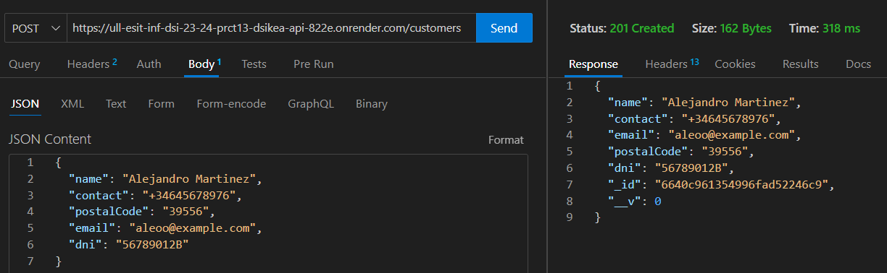
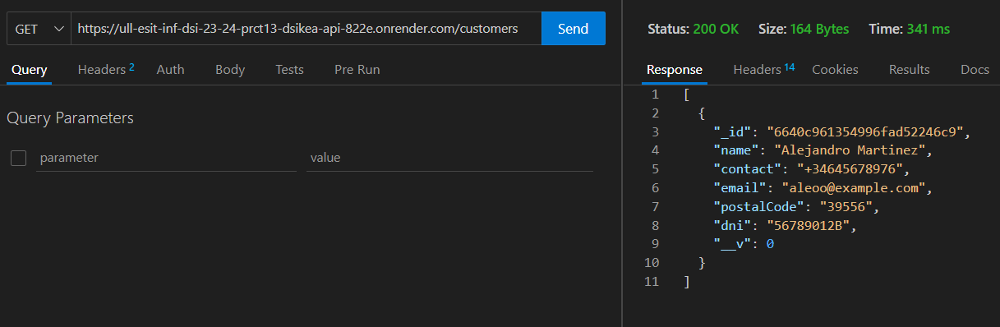
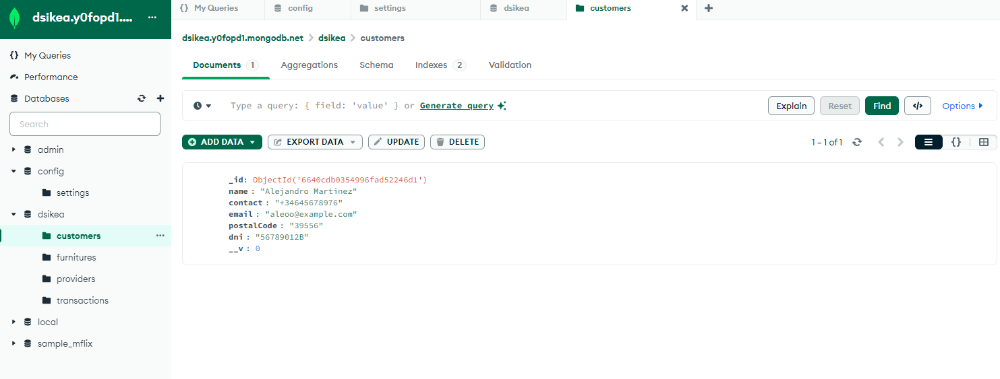
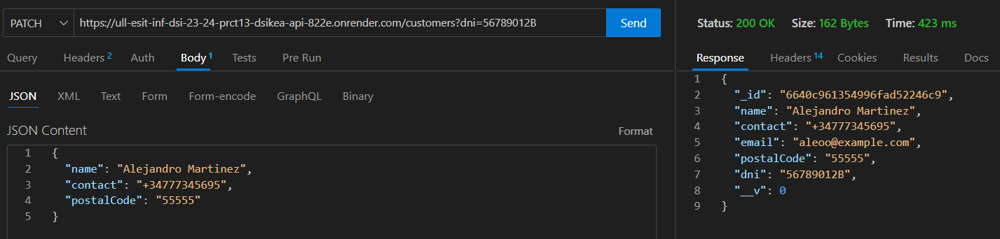
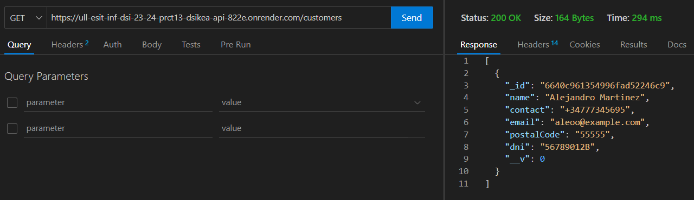
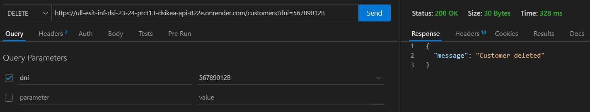
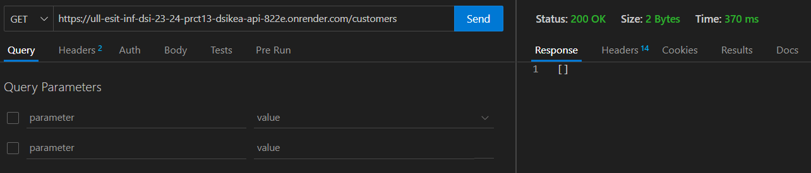

[](https://classroom.github.com/a/CaXtHsbh)

[](https://coveralls.io/github/ULL-ESIT-INF-DSI-2324/ull-esit-inf-dsi-23-24-prct13-dsikea-api-groupn?branch=main)

[](https://github.com/ULL-ESIT-INF-DSI-2324/ull-esit-inf-dsi-23-24-prct13-dsikea-api-groupn/actions/workflows/build.yml)

[](https://github.com/ULL-ESIT-INF-DSI-2324/ull-esit-inf-dsi-23-24-prct13-dsikea-api-groupn/actions/workflows/node.js.yml)

# Informe Práctica 13 - DSIkea: API REST con Node/Express


## Manuel David Gómez Alonso

> [alu0101347301@ull.edu.es](mailto:alu0101347301@ull.edu.es)

## Daniel Bensa Expósito Paz

> [alu0101481876@ull.edu.es](mailto:alu0101481876@ull.edu.es)

## Alejandro Javier Aguiar Pérez

> [alu0101487168@ull.edu.es](mailto:alu0101487168@ull.edu.es)

## Índice

1. [Resumen Proyecto](#resumen-proyecto)
2. [Modelado de objetos con Mongoose](#modelado-de-objetos-con-mongoose)
   - [Modelo Customer](#modelo-customer)
   - [Modelo Provider](#modelo-provider)
   - [Modelo Furniture](#modelo-furniture)
   - [Modelo Transaction](#modelo-transaction)
3. [Rutas](#rutas)
   - [/customers](#/customers)
   - [/providers](#/providers)
   - [/furnitures](#/furnitures)
   - [/transactions](#/transactions)
4. [Test sobre el API](#test-sobre-el-api)
5. [Despliegue API](#despliegue-api)
   - [MongoDB Atlas](#mongodb-atlas)
   - [Render](#render)
6. [Peticiones](#peticiones)
7. [Conclusiones del proyecto](#conclusiones-del-proyecto)
8. [Referencias](#referencias)

## Resumen Proyecto

El proyecto consiste en desarrollar una **API REST** para gestionar transacciones de muebles utilizando **Node.js**, **Express**, **Mongoose** y **MongoDB**. La API debe permitir a clientes y proveedores realizar **transacciones de compra y venta** de muebles, además de llevar a cabo operaciones **CRUD (Crear, Leer, Actualizar, Borrar)** para gestionar **clientes**, **proveedores**, **muebles** y **transacciones**.

En cuanto a los requisitos específicos del API, se detallan las rutas y operaciones que deben ser implementadas:

- **Clientes (/customers)**: Se deben poder realizar operaciones CRUD para gestionar clientes. La lectura o consulta de clientes puede realizarse por **NIF** o por **identificador único**. Se deben implementar **siete manejadores** diferentes para esta ruta.
- **Proveedores (/providers)**: Debe ser posible realizar operaciones CRUD para gestionar proveedores. La lectura o consulta de proveedores puede hacerse por **CIF** o por **identificador único**. También se requieren **siete manejadores** diferentes para esta ruta.
- **Muebles (/furnitures)**: Se deben implementar operaciones CRUD para gestionar muebles. La lectura o consulta de muebles puede hacerse por **diferentes campos**, como nombre, descripción o color, o por identificador único. Se necesitan **siete manejadores** diferentes para esta ruta.
- **Transacciones (/transactions)**: Debe ser posible crear, leer, actualizar y borrar transacciones con clientes y/o proveedores. Una transacción incluye información del **cliente/proveedor** y de los **muebles** involucrados, además de otros datos como fecha, hora e importe. Se deben manejar situaciones como la existencia previa de clientes/proveedores o muebles, la **actualización de stock** en caso de compra a proveedores, entre otros aspectos complejos. Se requieren **seis manejadores** diferentes para esta ruta.

También se debe de comprobar la funcionalidad del API elaborando las necesarias **pruebas unitarias**, y una vez concluida la correcta funcionalidad del API, desplegar la misma haciendo uso de **MongoDB Atlas** como base de datos y **Render**.

> **[Volver al índice](#índice)**

## Modelado de objetos con Mongoose

En este proyecto, se han creado varios modelos de objetos utilizando **Mongoose** para la interacción con la base de datos **MongoDB**. A continuación se detallan los modelos implementados:

### Modelo Customer

El modelo _Customer_ es una representación de un **cliente** en la base de datos.

Se crea una interfaz: _ICustomer_ que se extiende de la interfaz _Document_ de **Mongoose**, lo que significa que una instancia de _ICustomer_ es un **documento** de **Mongoose** que puede ser guardado en la base de datos. La interfaz _ICustomer_ define los siguientes campos:

```ts
export interface ICustomer extends Document {
  name: string;
  contact: string;
  email: string;
  postalCode: string;
  dni: string;
}
```

El esquema _customerSchema_ define cómo se guardan los datos en la base de datos de **MongoDB**. Define los mismos campos que la interfaz _ICustomer_, pero también especifica el **tipo de datos** de cada campo, si el campo es **requerido**, y cualquier **validación** que deba realizarse en el campo.

La **validación** se realiza utilizando la biblioteca **validator**. Por ejemplo, el campo _email_ utiliza _validator.isEmail(value)_ para verificar si el valor es un correo electrónico válido. Además se devuleve un mensaje de error especificando porque la creación del objeto ha fallado.

```ts
export const customerSchema: Schema = new Schema<ICustomer>({
  // Otros atributos...
  email: {
    type: String,
    required: true,
    validate: {
      validator: (value: string) => validator.isEmail(value),
      message: "Invalid email",
    },
  },
  // Otros atributos
});
```

Por último comentar la **validación** del campo _dni_ que identifica al **cliente** y por lo tanto debe ser única, para comprobar el dni se usa la fórmula definida para comprobar que la última letra coincida con los dígitos previos.

```ts
export const customerSchema: Schema = new Schema<ICustomer>({
  dni: {
    type: String,
    unique: true,
    required: true,
    validate: {
      validator: (value: string) => {
        const numeroDNI = parseInt(value.slice(0, -1), 10);
        const letraDNI = value.slice(-1);
        return letraDNI === calcularLetraDNI(numeroDNI);
      },
      message: "Invalid DNI",
    },
  },
});
```

Donde _calcularLetraDNI(numeroDNI)_ es una llamada a la función auxiliar que calcula la **última letra** en base a los dígitos anteriores.

```ts
function calcularLetraDNI(numeroDNI: number) {
  const letras = "TRWAGMYFPDXBNJZSQVHLCKE";
  const resto = numeroDNI % 23;
  return letras.charAt(resto);
}
```

> **[Volver al índice](#índice)**

### Modelo Provider

El modelo _Provider_ es una representación de un **proveedor** en la base de datos. Es muy similar a el modelo _Customer_ pero cambiando el atributo _dni_, que se resume en ocho dígitos y una letra final mayúscula, por el atributo _cif_, que empieza por una letra mayúscula seguida de 8 digitos.

Se crea una interfaz _IProvider_ que se extiende de la interfaz _Document_ de **Mongoose**, lo que significa que una instancia de _IProvider_ es un **documento** de **Mongoose** que puede ser guardado en la base de datos. La interfaz _IProvider_ define los siguientes campos:

```ts
export interface IProvider extends Document {
  name: string;
  contact: string;
  postalCode: string;
  cif: string;
}
```

El esquema _providerSchema_ define cómo se guardan los datos en la base de datos de **MongoDB**. Define los mismos campos que la interfaz _IProvider_, pero también especifica el **tipo de datos** de cada campo, si el campo es **requerido**, y cualquier **validación** que deba realizarse en el campo.

La **validación** es este caso del campo _cif_ del que hablabamos anteriormente se debe verificar de manera especial al igual que el campo _dni_ de un _customerSchema_. Se debe de tener en cuenta que el primer dígito del _cif_ no se elige de manera aleatoria y que depende de los digitos posteriores, para ello usamos una constante de **letras de control** permitidas y comprobamos que todo coincida como debería.

```ts
export const providerSchema: Schema = new Schema<IProvider>({
  // Otros atributos
  cif: {
    type: String,
    unique: true,
    required: true,
    validate: {
      validator: (value: string) => {
        const control = "JABCDEFGHI";
        const digit = value.slice(1, -1);
        const letter = value.charAt(0);
        const controlDigit = value.slice(-1);

        let sum = 0;
        for (let i = 0; i < digit.length; i++) {
          const num = parseInt(digit.charAt(i), 10);
          if (i % 2 === 0) {
            sum += [0, 2, 4, 6, 8, 1, 3, 5, 7, 9][num];
          } else {
            sum += num;
          }
        }

        const calculatedControlDigit = sum % 10 === 0 ? 0 : 10 - (sum % 10);
        return (
          /^[ABCDEFGHJNPQRSUVW]{1}/.test(letter) &&
          digit.length === 7 &&
          (controlDigit === calculatedControlDigit.toString() ||
            controlDigit === control.charAt(calculatedControlDigit))
        );
      },
      message: "Invalid CIF",
    },
  },
  // Otros atributos
});
```

> **[Volver al índice](#índice)**

### Modelo Furniture

El modelo _Furniture_ es una representación de un **mueble** en la base de datos.

Se crea la interfaz _IFurniture_ que se extiende de la interfaz _Document_ de **Mongoose**, lo que significa que una instancia de _IFurniture_ es un documento de **Mongoose** que puede ser guardado en la base de datos. La interfaz _IFurniture_ define los siguientes campos:

```ts
export interface IFurniture extends Document {
  name: string;
  description: string;
  material: string;
  dimensions: Dimension;
  price: number;
  quantity: number;
  color: string;
}
```

Donde el tipo _Dimension_ es un objeto que representa las **dimensiones** de un mueble. Incluye los campos _length_, _width_ y _height_, todos los cuales son números.

```ts
type Dimension = {
  length: number;
  width: number;
  height: number;
};
```

El esquema _furnitureSchema_ define cómo se guardan los datos en la base de datos de **MongoDB**. Define los mismos campos que la interfaz _IFurniture_, pero también especifica el **tipo de datos** de cada campo, si el campo es **requerido**, y cualquier **validación** que deba realizarse en el campo, que en el caso de este _schema_ se necesita solamente en el campo _quantity_, para que la cantidad nunca sea **menor que cero**. También se usan enumerados para algunos campos. Por ejemplo, el campo material es un string que debe ser uno de los siguientes: _"wood"_, _"metal"_, _"plastic"_, _"glass"_, _"fabric"_, _"leather"_.

```ts
export const furnitureSchema: Schema = new Schema<IFurniture>({
  // Otros atributos
  material: {
    type: String,
    enum: ["wood", "metal", "plastic", "glass", "fabric", "leather"],
    required: true,
  },
  // Otros atributos
  quantity: {
    type: Number,
    required: true,
    validate: {
      validator: function (value: number) {
        return value >= 0;
      },
      message: "Quantity must be a non-negative number",
    },
  },
  // Otros atributos
});
```

> **[Volver al índice](#índice)**

### Modelo Transaction

El modelo _Transaction_ es una representación de una **transacción** en la base de datos. El modelo _Transaction_ trabaja en coordinación con todos los demás modelos vistos previamente: _customerSchema_, _providerSchema_, _furnitureSchema_.

Se crea interfaz _ITransaction_ que se extiende de la interfaz _Document_ de **Mongoose**, lo que significa que una instancia de _ITransaction_ es un documento de **Mongoose** que puede ser guardado en la base de datos. La interfaz _ITransaction_ define los siguientes campos:

```ts
export interface ITransaction extends Document {
  type: "Purchase" | "Sale";
  furniture: FurnitureTuple[];
  customer?: typeof customerSchema;
  provider?: typeof providerSchema;
  date: Date;
  price: number;
}
```

Donde el tipo _FurnitureTuple_ es un objeto que representa un par de **mueble** y **cantidad**. Incluye los campos _furniture_ y _quantity_.

```ts
export interface FurnitureTuple {
  furniture: typeof furnitureSchema;
  quantity: number;
}
```

El esquema _transactionSchema_ define cómo se guardan los datos en la base de datos de **MongoDB**. Define los mismos campos que la interfaz _ITransaction_, pero también especifica el **tipo de datos** de cada campo, si el campo es **requerido**, y cualquier **validación** que deba realizarse en el campo.

Por ejemplo, el campo type es un _string_ que debe ser _"Purchase"_ o _"Sale"_. El campo _furniture_ es un array de objetos, cada uno de los cuales debe tener un campo _furniture_ que es un _ObjectId_ que hace **referencia a un documento** de _Furniture_, y un campo _quantity_ que es un número. No se usa el módulo validator ya que los atributos usados son enumerados en el caso de _type_, o bien **referencias a otros modelos**, o tienen pensado crearse de manera automatica por el programa como _date_ y _price_ y por lo tanto no debería de estar sujeto a errores.

```ts
export const transactionSchema = new Schema<ITransaction>({
  type: {
    type: String,
    enum: ["Purchase", "Sale"],
    required: true,
  },
  furniture: [
    {
      furniture: {
        type: Schema.Types.ObjectId,
        ref: "Furniture",
        required: true,
      },
      quantity: {
        type: Number,
        required: true,
      },
    },
  ],
  customer: {
    type: Schema.Types.ObjectId,
    ref: "Customer",
  },
  provider: {
    type: Schema.Types.ObjectId,
    ref: "Provider",
  },
  date: {
    type: Date,
    required: true,
  },
  price: {
    type: Number,
    required: true,
  },
});
```

> **[Volver al índice](#índice)**

## Rutas

Las **rutas** en la **API** definen los **puntos finales** a los que los clientes pueden enviar **peticiones** para interactuar con la aplicación. Cada **ruta** está asociada con una función específica de la **API**. En la **API**, se tienen **rutas** para cuatro recursos diferentes: _Customer_, _Provider_, _Furniture_ y _Transaction_. Cada uno de estos recursos tienen rutas para las operaciones **CRUD (Crear, Leer, Actualizar, Eliminar)**.

### /customers

Proporciona funcionalidades para administrar clientes en el sistema.

#### GET /customers

Recupera información sobre clientes. Si se proporciona un número de identificación (DNI) en el query, devuelve los detalles del cliente correspondiente. Sin embargo, si no se proporciona ningún DNI, devuelve una lista de todos los clientes registrados.

#### GET /customers/:id

Este endpoint en un sistema de gestión de clientes, permite a los usuarios obtener detalles específicos sobre un cliente en particular.

La estructura del endpoint está diseñada para manejar solicitudes GET que llegan a la ruta /customers/:id, donde :id es un parámetro dinámico que representa el ID del cliente que se desea consultar.

#### POST /customers

Permite agregar un nuevo cliente al sistema. Se requieren varios campos, incluido el nombre, contacto, correo electrónico, código postal y DNI. Antes de agregar un nuevo cliente, se verifica que el DNI no esté duplicado en la base de datos.

#### PATCH /customers

Actualiza la información de un cliente según su DNI. Se espera que el DNI se proporcione en el cuerpo de la solicitud. Solo se permiten actualizaciones de nombre, contacto, código postal y DNI.

#### PATCH /customers/:id

Actualiza la información de un cliente según su DNI. En este caso, :id es un marcador de posición para el identificador único del cliente al que se refiere la solicitud. Solo se permiten actualizaciones de nombre, contacto, código postal y DNI en relacion a ese id.

#### DELETE /customers

Elimina un cliente según su DNI. Se espera que el DNI se proporcione en el cuerpo de la solicitud.

#### DELETE /customers/:id

Elimina un cliente según su DNI. En este caso, :id es un marcador de posición para el identificador único del cliente al que se refiere la solicitud. Por lo que se eliminará el customer identificado con esa id.

> **[Volver al índice](#índice)**

### /providers

Proporciona funcionalidades para administrar provedores en el sistema.

#### GET /providers:

Obtener todos los proveedores o para buscar proveedores por su CIF. Si se proporciona un CIF en los parámetros de consulta, se realiza una búsqueda en la base de datos utilizando ese CIF y se devuelve el proveedor correspondiente si se encuentra. Si no se proporciona un CIF en los parámetros de consulta, se devuelven todos los proveedores. Se manejan los casos en los que no se encuentran proveedores o hay errores de servidor.

#### GET /providers/:id:

Obtener un proveedor específico por su ID. El ID del proveedor se proporciona como parte de la URL. Se busca el proveedor en la base de datos utilizando el ID proporcionado y se devuelve si se encuentra. Se manejan los casos en los que no se encuentra el proveedor o hay errores de servidor.

#### POST /providers:

Crear un nuevo proveedor. Los datos del proveedor se esperan en el cuerpo de la solicitud en formato JSON. Se crea un nuevo proveedor con los datos proporcionados y se manejan los casos en los que ya existe un proveedor con el mismo CIF.

#### PATCH /providers:

Actualizar información sobre uno o varios proveedores basándose en el CIF proporcionado en los parámetros de consulta. Se manejan los casos en los que no se proporcionan parámetros de consulta o la actualización no está permitida.

#### PATCH /providers/:id:

Actualizar información sobre un proveedor específico identificado por su ID. El ID del proveedor se proporciona como parte de la URL. Se manejan los casos en los que no se pueden realizar ciertas actualizaciones y se manejan los casos en los que no se encuentra el proveedor.

#### DELETE /providers:

Eliminar uno o varios proveedores basándose en el CIF proporcionado en los parámetros de consulta. Se manejan los casos en los que no se proporciona un CIF en los parámetros de consulta o el proveedor no se encuentra.

#### DELETE /providers/:id:

Eliminar un proveedor específico identificado por su ID. El ID del proveedor se proporciona como parte de la URL. Se manejan los casos en los que no se encuentra el proveedor o hay errores de servidor.

> **[Volver al índice](#índice)**

### /furnitures

Proporciona funcionalidades para administrar muebles en el sistema.

#### GET /furnitures

Obtener todos los muebles o para buscar muebles por nombre, descripción, material, precio, etc. Si se proporcionan parámetros de búsqueda válidos, se realiza una búsqueda en la base de datos utilizando esos parámetros y se devuelve una lista de muebles que coinciden. Si no se proporcionan parámetros de búsqueda o los parámetros son inválidos, se devuelve un mensaje de error correspondiente.

#### GET /furnitures/:id

Obtener un mueble específico por su ID. El ID del mueble se proporciona como parte de la URL. Si se encuentra un mueble con el ID proporcionado, se devuelve ese mueble. Si no se encuentra ningún mueble con el ID proporcionado, se devuelve un mensaje de error.

#### POST /furnitures

Crear un nuevo mueble. Se espera que los datos del mueble se proporcionen en el cuerpo de la solicitud en formato JSON. Antes de crear el mueble, se realizan algunas comprobaciones, como verificar si la cantidad de muebles es 0, ya que parece que se requiere una transacción para agregar muebles con una cantidad distinta de 0.

#### PATCH /furnitures

Actualizar información sobre los muebles. Puede actualizar información de uno o varios muebles basándose en los parámetros de búsqueda proporcionados en el cuerpo de la solicitud. Antes de actualizar los muebles, se realizan algunas comprobaciones, como verificar si la cantidad de muebles es 0, ya que parece que se requiere una transacción para agregar muebles con una cantidad distinta de 0.

#### PATCH /furnitures/:id

Actualizar información sobre un mueble específico identificado por su ID. El ID del mueble se proporciona como parte de la URL. Se espera que los datos actualizados del mueble se proporcionen en el cuerpo de la solicitud en formato JSON.

#### DELETE /furnitures/:id

Eliminar un mueble específico por su ID. El ID del mueble se proporciona como parte de la URL. Si se encuentra un mueble con el ID proporcionado, se elimina y se devuelve un mensaje de éxito. Si no se encuentra ningún mueble con el ID proporcionado, se devuelve un mensaje de error.

#### DELETE /furnitures

Eliminar uno o varios muebles basándose en los parámetros de búsqueda proporcionados en el cuerpo de la solicitud. Antes de eliminar los muebles, se realizan algunas comprobaciones, como verificar si la cantidad de muebles es 0, ya que parece que se requiere una transacción para agregar muebles con una cantidad distinta de 0.

> **[Volver al índice](#índice)**

### /transactions

Proporciona funcionalidades para administrar transacciones en el sistema.

#### GET /transactions

Obtener todas las transacciones o para buscar transacciones basadas en varios parámetros de consulta. Si no se proporcionan parámetros de consulta, se devuelven todas las transacciones. Si se proporciona un parámetro de consulta 'dni', se recuperan las transacciones asociadas al número de identificación del cliente. Si se proporciona un parámetro de consulta 'cif', se recuperan las transacciones asociadas al número de identificación fiscal del proveedor. Si se proporcionan los parámetros de consulta 'Idate' y 'Fdate', se recuperan las transacciones dentro de un rango de fechas. Se manejan los casos en los que no se encuentran transacciones o hay errores de servidor.

#### GET /transactions/:id

Obtener una transacción específica por su ID. El ID de la transacción se proporciona como parte de la URL. Se busca la transacción en la base de datos utilizando el ID proporcionado y se devuelve si se encuentra. Se manejan los casos en los que no se encuentra la transacción o hay errores de servidor.

#### POST /transactions

Crear nuevas transacciones, ya sea ventas o compras. Los detalles de la transacción se esperan en el cuerpo de la solicitud en formato JSON. Se manejan los casos en los que no se encuentra el cliente o el proveedor asociado, así como los casos en los que hay errores en la creación de la transacción.

#### PATCH /transactions/:id

Actualizar información sobre una transacción específica identificada por su ID. Se manejan los casos en los que no se encuentra la transacción, no se pueden realizar ciertas actualizaciones o hay errores de servidor.

#### DELETE /transactions/:id

Eliminar una transacción específica identificada por su ID. El ID de la transacción se proporciona como parte de la URL. Se manejan los casos en los que no se encuentra la transacción o hay errores de servidor.

#### DELETE /transactions

Eliminar todas las transacciones o para eliminar transacciones en función de ciertos parámetros de consulta. Se manejan los casos en los que no se proporcionan los parámetros de consulta necesarios o hay errores de servidor.

> **[Volver al índice](#índice)**

## Test sobre el API

### Customers

Estos tests prueban diferentes aspectos de la API relacionados con las operaciones CRUD (Crear, Leer, Actualizar, Eliminar) para la entidad de cliente

#### GET /customers:

Prueba la recuperación de un cliente por su DNI.

Prueba la recuperación de todos los clientes.

Prueba la respuesta cuando no se encuentra un cliente con un DNI específico.

#### GET /customers/:id:

Prueba la recuperación de un cliente por su ID.

Prueba la respuesta cuando no se encuentra un cliente con un ID específico.

#### POST /customers:

Prueba la creación exitosa de un nuevo cliente.

Prueba la respuesta cuando se intenta crear un cliente con un DNI que ya existe.

Prueba la respuesta cuando se proporciona un número de teléfono no válido.

#### PATCH /customers:

Prueba la modificación exitosa de un cliente por su DNI.

Prueba la respuesta cuando se intenta modificar atributos no permitidos.

Prueba la respuesta cuando se intenta modificar un cliente que no existe.

#### PATCH /customers/:id:

Prueba la modificación exitosa de un cliente por su ID.

Prueba la respuesta cuando se intenta modificar atributos no permitidos.

Prueba la respuesta cuando se intenta modificar un cliente que no existe.

#### DELETE /customers/:id:

Prueba la eliminación exitosa de un cliente por su ID.

Prueba la respuesta cuando se intenta eliminar un cliente que no existe.

#### DELETE /customers:

Prueba la eliminación exitosa de un cliente por su DNI.

Prueba la respuesta cuando se intenta eliminar un cliente que no existe.

Prueba la respuesta cuando no se proporciona un DNI en el cuerpo de la solicitud.

### Providers

Estos tests prueban diferentes aspectos de la API relacionados con las operaciones CRUD (Crear, Leer, Actualizar, Eliminar) para la entidad de proveedores

#### GET /providers:

Prueba la recuperación de un proveedor por su CIF.

Prueba la recuperación de todos los proveedores.

Prueba la respuesta cuando no se encuentra un proveedor con un CIF específico.

#### GET /providers/:id:

Prueba la recuperación de un proveedor por su ID.

Prueba la respuesta cuando no se encuentra un proveedor con un ID específico.

#### POST /providers:

Prueba la creación exitosa de un nuevo proveedor.

Prueba la respuesta cuando se intenta crear un proveedor con un CIF que ya existe.

Prueba la respuesta cuando se proporciona un número de teléfono no válido.

#### PATCH /providers:

Prueba la modificación exitosa de un proveedor por su CIF.

Prueba la respuesta cuando se intenta modificar atributos no permitidos.

Prueba la respuesta cuando se intenta modificar un proveedor que no existe.

#### PATCH /providers/:id:

Prueba la modificación exitosa de un proveedor por su ID.

Prueba la respuesta cuando se intenta modificar atributos no permitidos.

Prueba la respuesta cuando se intenta modificar un proveedor que no existe.

#### DELETE /providers/:id:

Prueba la eliminación exitosa de un proveedor por su ID.

Prueba la respuesta cuando se intenta eliminar un proveedor que no existe.

#### DELETE /providers:

Prueba la eliminación exitosa de un proveedor por su CIF.

Prueba la respuesta cuando se intenta eliminar un proveedor que no existe.

Prueba la respuesta cuando no se proporciona un CIF en el cuerpo de la
solicitud.

### Furnitures

Estos tests prueban diferentes aspectos de la API relacionados con las operaciones CRUD (Crear, Leer, Actualizar, Eliminar) para la entidad de muebles

#### GET /furnitures:

Prueba la recuperación de todos los muebles.

Prueba la recuperación de muebles por nombre.

Prueba la respuesta cuando no se encuentra un mueble con un nombre específico.

Prueba la recuperación de muebles por material.

#### GET /furnitures/:id:

Prueba la recuperación de un mueble por su ID.

Prueba la respuesta cuando no se encuentra un mueble con un ID específico.

#### POST /furnitures:

Prueba la creación exitosa de un nuevo mueble.

Prueba la respuesta cuando se intenta crear un mueble con una cantidad distinta de 0.

Prueba la respuesta cuando faltan atributos obligatorios.

Prueba la respuesta cuando se intenta agregar una cantidad al crear un mueble.

#### PATCH /furnitures/:id:

Prueba la modificación exitosa de un mueble por su ID.

Prueba la respuesta cuando se intenta modificar un mueble que no existe.

Prueba la respuesta cuando se intenta agregar una cantidad al modificar un mueble.

#### PATCH /furnitures:

Prueba la modificación exitosa de un mueble por nombre y material.

Prueba la respuesta cuando se intenta modificar un mueble que no existe.

Prueba la respuesta cuando se intenta agregar una cantidad al modificar un mueble.

Prueba la respuesta cuando se proporcionan parámetros de búsqueda no válidos.

#### DELETE /furnitures:

Prueba la eliminación exitosa de un mueble por nombre.

Prueba la respuesta cuando se encuentran múltiples muebles coincidentes.

Prueba la respuesta cuando se proporcionan atributos de búsqueda no válidos.

#### DELETE /furnitures/:id:

Prueba la eliminación exitosa de un mueble por su ID.

Prueba la respuesta cuando no se encuentra un mueble con un ID específico.

Prueba la respuesta cuando el formato del ID del mueble no es válido.

### /transactions

Nos adentramos en la más complicada de las rutas debido a la cantidad de comprobaciones que hay que hacer y a la lógica que hay detrás de esta, esta ruta controlará el stock y como vimos en los esquemás tendrá que tener referencias a proveedores, a clientes y a los muebles implicados, la petición `get` es bastante sencilla, vamos a destacar la primera de ellas, contendrá casos como los siguientes:

1. No especificar nada en la query string con la ruta /transactions.

```typescript
  if (Object.keys(req.query).length === 0) {
    try {
      const transactions = await Transaction.find();
      if (transactions) {
        return res.send(transactions);
      } else {
        return res.status(404).send({ error: "Transactions not found" });
      }
    } catch (error) {
      return res.status(500).send(error);
    }
  }
```
En este caso lo que se hará es mostrar todas las transacciones disponibles.

2. Se encuentra el DNI en la query.

```typescript
 if (req.query.dni) {
      try {
        const customer = await Customer.findOne({ dni: req.query.dni });
        if (customer) {
          const transactions = await Transaction.find({
            customer: customer._id,
          });
          if (transactions) {
            return res.send(transactions);
          } else {
            return res.status(404).send({ error: "Transactions not found" });
          }
        } else {
          return res.status(404).send({ error: "Customer not found" });
        }
      } catch (error) {
        return res.status(500).send(error);
      }
  }
``` 
En este caso buscaremos las transacciones con este campo, tras haber comprobado que el cliente realmente existe con la 3 línea en código anterior, linea que usaremos en el resto del código para realizar la misma comprobación. Además el código será muy parecido los proveedores.

3. Intervalo de fechas.

```typescript
    } else if (req.query.Idate && req.query.Fdate) {
      try {
        const transactions = await Transaction.find({
          date: { $gte: req.query.Idate, $lte: req.query.Fdate },
        });
        if (transactions) {
          return res.send(transactions);
        } else {
          return res.status(404).send({ error: "Transactions not found" });
        }
      } catch (error) {
        return res.status(500).send(error);
      }
    }
```

Vemos como el mismo find nos da la opción de realizar la búsqueda con un intervalo de fechas.

4. Busqueda mediante la ruta /transactions/id

```typescript
transactionsRouter.get(
  "/transactions/:id",
  async (req, res) => {
    try {
      const transaction = await Transaction.findOne({ _id: req.params.id });
      if (transaction) {
        return res.status(201).send(transaction);
      } else {
        return res.status(404).send({ error: "Transaction not found" });
      }
    } catch (error) {
      return res.status(500).send(error);
    }
  },
);
``` 
Simplemente buscaremos por el dni pasado como parámetro.


Siguiendo con las peticiones viene una de las complicadas debido a las comprobaciones siendo esta el `post`, En nuestro caso se comprobarán las siguientes condiciones:

- Si hay un DNI el tipo debe de ser "Sale" y si es un CIF debe de ser "purchase".
- Se comprueba que exista un cliente/proveedor al que pertenezca ese CIF/DNI.
- Para las ventas se comprueba que el mueble exista y además que hayan existencias.
- Para las compras a proveedores, se comprueba que existan los muebles y además se sumará la cantidad adquirida al stock.

La petición que se lleva la palma en cuanto a lógica se refiere es `patch` que sirve para modificar una transacción, más o menos se utilizar la misma lógica que en la anterior (post) pero, si el usuario quiere cambiar los muebles, se utiliza la siguiente función para dejar el stock como estaba antes de realizar la transacción actual:

```typescript
export async function resetPurchase(transaction: FurnitureTuple[]) {
  for (const item of transaction) {
    const foundFurniture = await Furniture.findOne({ _id: item.furniture });
    if (!foundFurniture) {
      return { error: "Furniture not found" };
    }
    const resetQuantity = foundFurniture.quantity - item.quantity;
    Furniture.updateOne({ _id: item.furniture }, { quantity: resetQuantity });
  }
}
```

Al hacer esto reestablecemos el stock anterior a la transacción, y gracias a la función anterior:

```typescript
export async function getPurchase(
  furniture: IFurniture[],
): Promise<
  | { furniture: { furniture: string; quantity: number }[]; totalPrice: number }
  | { error: string }
> {
  let tPrice: number = 0;
  const foundFurniture: [string, number][] = [];
  for (const item of furniture) {
    let foundFurnitureObject = await Furniture.findOne({
      name: item.name,
      material: item.material,
      color: item.color,
    });
    if (item.quantity <= 0) {
      return {
        error: "Quantity must be a positive number",
      };
    }
    if (!foundFurnitureObject) {
      foundFurnitureObject = new Furniture(item);
    } else {
      await Furniture.updateOne(
        { _id: foundFurnitureObject._id },
        { quantity: foundFurnitureObject.quantity + item.quantity },
      );
    }
    tPrice += foundFurnitureObject.price * item.quantity;
    foundFurniture.push([foundFurnitureObject._id, item.quantity]);
  }
  // console.log("Antes de enviar: ", foundFurniture, tPrice);
  const formattedFurniture = foundFurniture.map(([furniture, quantity]) => ({
    furniture,
    quantity,
  }));
  return { furniture: formattedFurniture, totalPrice: tPrice };
}
```
Haremos que se modifique el stock con los muebles que desea poner el usuario en dicha transacción. Por último cada vez que se utiliza el comando `findOneAndUpdate` se utilizará una variable booleana llamada `update`, que se comprobará que sea verdadera al final de la petición para hacer saber al usuario que la petición ha sido completada con éxito o no. A continuación 2 ejemplos sobre el uso de `update`, y la lógica final.

```typescript
  if (req.body.date) {
    Transaction.findByIdAndUpdate(
      { _id: req.params.id },
      { date: req.body.date },
      { new: true, runValidators: true },
    );
    update = true;
  }
```

```typescript
if (transaction.type === "Sale") {
    if (req.body.customer) {
      const customer = await Customer.findOne({ _id: req.body.customer });
      if (customer) {
        Transaction.findByIdAndUpdate(
          { _id: req.params.id },
          { customer: req.body.customer },
          { new: true, runValidators: true },
        );
        update = true;
      } else {
        return res.status(404).send({ error: "Customer not found" });
      }
```

```typescript
  if(update) {
      return res.status(201).send({ message: "Transaction updated" });
  } else{
      return res.status(400).send({ error: "No valid fields to update" });
  }
```

Finalizando con la ruta, comentaremos la petición `delete`, creemos que al eliminar una transacción, el stock debe de volver a como estaba antes de ella, por lo que utilizaremos las funciones anteirores `resetPruchase` y `resetSale`, además creemos que no deberían de borrarse las transacciones aun que se haya borrado el cliente o el proveedor al que se le hizo de la base de datos.

```typescript
transactionsRouter.delete(
  "/transactions/:id",
  async (req: Request, res: Response) => {
    try {
      const transaction = await Transaction.findOne({
        _id: req.params.id,
      });
      if (transaction) {
        if (transaction.type === "Sale") {
          resetSale(transaction.furniture);
          Transaction.findOneAndDelete({ _id: req.params.id });
          return res.status(201).send("Transaction deleted");
        } else if (transaction.type === "Purchase") {
          resetPurchase(transaction.furniture);
          Transaction.findOneAndDelete({ _id: req.params.id });
          return res.status(201).send("Transaction deleted");
        }
      } else {
        return res.status(404).send({ error: "Transaction not found" });
      }
    } catch {
      return res.status(500).send(Error);
    }
  },
);
```

> **[Volver al índice](#índice)**

## Despliegue API

El proyecto tambien requería en última instancia de **desplegar** el **API**, para ello hacemos uso de dos herramientas: **MogoDB Atlas** y **Render**

### MongoDB Atlas

Debemos crearnos una cuenta en **MongoDB Atlas** y en ella crear un _cluster_ donde alojar nuestra base de datos, luego posteriormente descargamos **MongoDB Compass**, que aunque realmente no es necesario nos permite contar con una **interfaz gráfica** de la base de datos que estamos usando. Para conectar la base de datos con **Compass** usamos el enlace propio de la base de datos que se encuentra en **Atlas**.

> **[Volver al índice](#índice)**

### Render

**Render** es una plataforma de alojamiento y **despliegue** que proporciona una infraestructura robusta y escalable para aplicaciones web y APIs. Su papel en el **despliegue** de APIs es facilitar el proceso de implementación y gestión de aplicaciones, pero lamentablemente no cuenta con una base de datos propia, es por ello que debemos de crear una variable de entorno _MOGODB_URL_ que contenga el enlace a la base de datos que hemos creado previamente en **MongoDB Atlas**. También debemos añadir dos scripts en nuestro _package.json_ que al ser usados en Render permiten desplegar el API por completo. Por último para que nuestro programa entienda que debe usar la variable de entorno _MOGODB_URL_ debemos de modificar nuestra conección usando _"proccess.env"_.

```ts
connect(process.env.MONGODB_URL!)
  .then(() => {
    console.log("Connected to the database");
  })
  .catch(() => {
    console.log("Something went wrong when conecting to the database");
    process.exit(-1);
  });
```

> **[Volver al índice](#índice)**

## Peticiones

Una vez hayamos comprobado que el despliegue de la API funcione correctamente, podremos enviar peticiones a la API usando, en nuestro caso, la siguiente url: _"https://ull-esit-inf-dsi-23-24-prct13-dsikea-api-822e.onrender.com"_

Aquí se muestran algunas de las peticiones que se llevan cabo usando ThunderClient en la ruta customers mostrando el correcto funcionamiento del API desplegada:

- Se realiza una petición GET a la ruta /customers y obtenemos una lista vacía ya que ahora mismo no se encuentra ningún dato en la base de datos sobre clientes:



- Creamos una petición POST adjuntando en el cuerpo el JSON necesario para la creación de un cliente:


- Volvemos a realizar la petición GET para comprobar que el cliente ha sido añadido:



- En este punto podemos comprobar en Atlas si se ha creado el documento:



- Comprobamos si se puede actualizar la información de un cliente usando su dni:



- Comprobamos que haya surtido efecto en la base de datos realizando la petción GET y comprobando que los atributos hayan sido cambiados:



- Por último eliminamos el cliente:



- Y por supuesto, visualizamos a través de la petición GET si se ha eliminado correctamente:



> **[Volver al índice](#índice)**

## Conclusiones del proyecto

Este proyecto nos ha permitido adentrarnos en el fascinante mundo del desarrollo de API REST utilizando tecnologías como Node.js, Express, Mongoose y MongoDB. Durante el desarrollo, hemos aprendido y aplicado conceptos fundamentales de programación asíncrona, manejo de bases de datos NoSQL, modelado de datos con Mongoose, y diseño de rutas y controladores en Express. Hemos logrado implementar una API robusta y funcional que cumple con los requisitos establecidos, permitiendo la gestión completa de transacciones de muebles, clientes y proveedores. Además, hemos incorporado funcionalidades avanzadas como operaciones CRUD, autenticación de usuarios, y validación de datos para garantizar la integridad y seguridad de la información.

Durante el proceso, enfrentamos diversos desafíos técnicos y tomamos decisiones clave en cuanto a la arquitectura y diseño de la API. Estos desafíos nos han permitido fortalecer nuestras habilidades de resolución de problemas y toma de decisiones, así como mejorar nuestra comprensión de los principios subyacentes de desarrollo de software.
Hemos ampliado nuestro conocimiento sobre el desarrollo de aplicaciones web modernas y hemos adquirido experiencia práctica en el uso de herramientas y tecnologías ampliamente utilizadas en la industria. Estamos emocionados de aplicar lo que hemos aprendido en proyectos futuros y de seguir explorando nuevas áreas dentro del desarrollo de software.

Estamos satisfechos con el resultado final del proyecto y creemos que hemos alcanzado nuestros objetivos de manera efectiva. Este proyecto ha sido una experiencia enriquecedora que nos ha permitido crecer como desarrolladores y nos ha preparado para enfrentar desafíos más grandes en el futuro. Estamos ansiosos por aplicar lo que hemos aprendido y seguir mejorando nuestras habilidades en el emocionante mundo del desarrollo de software.

> **[Volver al índice](#índice)**

## Referencias

[Node.js](https://nodejs.org/docs/latest/api/fs.html)

[Express](https://expressjs.com/es/guide/routing.html)

[Mongoose](https://mongoosejs.com/docs/guide.html)

[MongoDB](https://www.mongodb.com/docs/manual/)

[Validator](https://www.npmjs.com/package/validator)

[SuperTest](https://www.npmjs.com/package/supertest)

[MongoDB Atlas](https://www.mongodb.com/docs/atlas/)

[Render](https://render.com)

[Apuntes Asignatura](https://ull-esit-inf-dsi-2324.github.io/nodejs-theory/)

> **[Volver al índice](#índice)**
